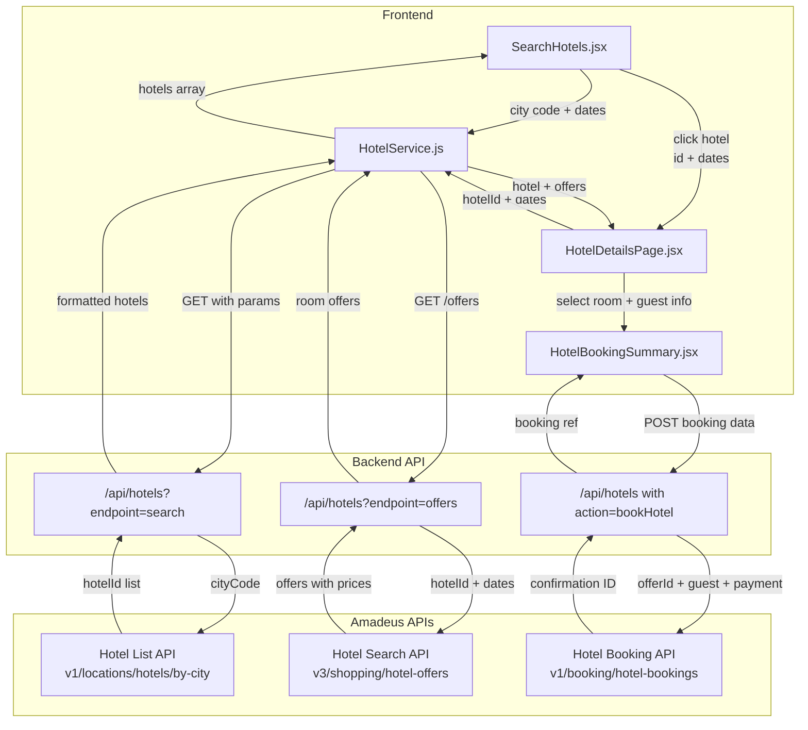

# Fix Hotel Booking Flow with Amadeus API Integration

## Problem Analysis

Based on the console logs and screenshots provided:

1. **"Hotel Not Found" error** - When clicking hotels from search results
2. **404 errors** - Backend `/api/hotels/search` endpoint not responding in production
3. **CORS issues** - Frontend was calling Amadeus directly (now fixed locally, needs deployment)
4. **Mock data fallback** - No real Amadeus hotel data being displayed
5. **Missing Punjab/regional cities** - Need better fallback for cities Amadeus doesn't recognize

## Root Causes

### Issue 1: Hotel ID Format Mismatch

**Current flow:**

- Backend returns: `id: hotel.hotelId` (raw Amadeus ID like `"ILIXC042"`)
- HotelService expects: `"amadeus-{hotelId}"` prefix OR `"{destination}-{number}"` for JSON
- Result: `getHotelById()` fails because raw Amadeus IDs don't match either pattern

**Files affected:**

- `[backend/controllers/hotel.controller.js](backend/controllers/hotel.controller.js)` - Line 207, 245 (returns raw `hotel.hotelId`)
- `[resources/js/Services/HotelService.js](resources/js/Services/HotelService.js)` - Lines 98-114 (checks for `-` or `amadeus-` prefix)

### Issue 2: Details Page Not Fetching Real Offers

**Current flow:**

- `HotelDetailsPage.jsx` calls `hotelService.getHotelById(hotelId)`
- `getHotelById()` only checks JSON fallback data
- Never calls `/api/hotels/offers/{hotelId}` with dates
- Result: Shows generic room data instead of real-time Amadeus offers

**Files affected:**

- `[resources/js/Pages/Common/hotels/HotelDetailsPage.jsx](resources/js/Pages/Common/hotels/HotelDetailsPage.jsx)` - Lines 44-73
- `[resources/js/Services/HotelService.js](resources/js/Services/HotelService.js)` - Lines 94-152

### Issue 3: Backend Endpoint Not Deployed

**Current state:**

- Vercel uses `[api/hotels.js](api/hotels.js)` serverless function
- Express backend uses `[backend/routes/hotel.routes.js](backend/routes/hotel.routes.js)`
- Production calls `https://www.jetsetterss.com/api/hotels/search` → 404
- Vercel routing expects query param: `/api/hotels?endpoint=search`

**Files affected:**

- `[vercel.json](vercel.json)` - Routing configuration
- `[api/hotels.js](api/hotels.js)` - Serverless handler (needs proper routing)

## Solution Architecture




## Implementation Plan

### Step 1: Fix Hotel ID Format Consistency

**Update backend to add consistent ID prefixes:**

In `[backend/controllers/hotel.controller.js](backend/controllers/hotel.controller.js)`, change hotel formatting (lines 206-222):

```javascript
formattedHotels.push({
  id: `amadeus-${hotel.hotelId}`,  // Add prefix for Amadeus hotels
  hotelId: hotel.hotelId,           // Keep raw ID for API calls
  name: hotel.name,
  // ... rest of fields
});
```

**Update HotelService to handle both formats:**

In `[resources/js/Services/HotelService.js](resources/js/Services/HotelService.js)`, improve `getHotelById()` (lines 94-115):

```javascript
async getHotelById(hotelId) {
    // Check if it's a JSON hotel (format: "destination-number")
    if (hotelId && hotelId.includes('-') && !hotelId.startsWith('amadeus-')) {
        return this.getHotelFromJsonById(hotelId);
    }

    // If it's an Amadeus hotel, fetch real-time offers
    if (hotelId && hotelId.startsWith('amadeus-')) {
        const rawHotelId = hotelId.replace('amadeus-', '');
        // Call backend to get hotel with offers
        // Implementation in Step 2
        return await this.fetchAmadeusHotelDetails(rawHotelId);
    }

    // Fallback to JSON
    return this.getHotelFromJsonById(hotelId);
}
```

### Step 2: Implement Real-Time Hotel Details & Offers

**Add new method to HotelService:**

In `[resources/js/Services/HotelService.js](resources/js/Services/HotelService.js)`, add after `getHotelById()`:

```javascript
async fetchAmadeusHotelDetails(rawHotelId, checkInDate, checkOutDate, adults = 2) {
    try {
        console.log(`Fetching Amadeus hotel details for ${rawHotelId}...`);
        
        // Call backend offers endpoint
        const url = isProduction 
            ? `${API_BASE_URL}/hotels?endpoint=offers&hotelId=${rawHotelId}&checkInDate=${checkInDate}&checkOutDate=${checkOutDate}&adults=${adults}`
            : `${API_BASE_URL}/hotels/offers/${rawHotelId}?checkInDate=${checkInDate}&checkOutDate=${checkOutDate}&adults=${adults}`;
        
        const response = await axios.get(url, { timeout: 15000 });
        
        if (response.data?.success && response.data?.data) {
            return this.transformAmadeusOfferToHotelObject(response.data.data);
        }
        
        return null;
    } catch (error) {
        console.error('Failed to fetch Amadeus hotel details:', error);
        return null;
    }
}

transformAmadeusOfferToHotelObject(offerData) {
    // Transform Amadeus hotel offer response to match frontend hotel object shape
    const hotel = offerData.hotel || {};
    const offers = offerData.offers || [];
    
    return {
        id: `amadeus-${hotel.hotelId}`,
        hotelId: hotel.hotelId,
        name: hotel.name,
        location: hotel.cityCode,
        image: `https://images.unsplash.com/photo-1566073771259-6a8506099945`,
        images: [`https://images.unsplash.com/photo-1566073771259-6a8506099945`],
        rating: 4.5,
        amenities: ['Free WiFi', 'Air Conditioning', '24-hour Front Desk'],
        rooms: offers.map(offer => ({
            id: offer.id,
            type: offer.room?.typeEstimated?.category || 'Standard Room',
            price: parseFloat(offer.price?.total || 0),
            currency: offer.price?.currency || 'USD',
            description: offer.room?.description?.text || '',
            // ... other offer details
        }))
    };
}
```

**Update HotelDetailsPage to pass dates:**

In `[resources/js/Pages/Common/hotels/HotelDetailsPage.jsx](resources/js/Pages/Common/hotels/HotelDetailsPage.jsx)`, modify fetch logic (lines 44-73):

```javascript
const fetchHotel = async () => {
    if (!hotelId) {
        setError('No hotel ID provided');
        setLoading(false);
        return;
    }

    setLoading(true);
    try {
        // For Amadeus hotels, pass dates to get real-time offers
        let hotelData;
        if (hotelId.startsWith('amadeus-')) {
            hotelData = await hotelService.getHotelById(
                hotelId, 
                checkInDate || getDefaultCheckIn(), 
                checkOutDate || getDefaultCheckOut(), 
                adultsParam
            );
        } else {
            hotelData = await hotelService.getHotelById(hotelId);
        }
        
        if (hotelData) {
            setHotel(hotelData);
            if (hotelData.rooms && hotelData.rooms.length > 0) {
                setSelectedRoom(hotelData.rooms[0]);
            }
        } else {
            setError('Hotel not found');
        }
    } catch (err) {
        console.error('Error fetching hotel:', err);
        setError('Failed to load hotel details');
    } finally {
        setLoading(false);
    }
};
```

### Step 3: Fix Backend API Routing for Production

**Update vercel.json routing:**

Current `[vercel.json](vercel.json)` routes `/api/:path*` to serverless functions. The issue is the serverless handler expects query params.

Add specific hotel routes in `[vercel.json](vercel.json)`:

```json
{
  "rewrites": [
    {
      "source": "/api/hotels/search",
      "destination": "/api/hotels?endpoint=search"
    },
    {
      "source": "/api/hotels/offers/:hotelId",
      "destination": "/api/hotels?endpoint=offers&hotelId=:hotelId"
    },
    {
      "source": "/api/hotels/locations",
      "destination": "/api/hotels?endpoint=locations"
    },
    // ... existing routes
  ]
}
```

### Step 4: Add Punjab Region Support

**Update city code mapping:**

In `[resources/js/Services/HotelService.js](resources/js/Services/HotelService.js)`, add Punjab cities to `getCityCode()` method (lines 210-296):

```javascript
'chandigarh': 'IXC',
'amritsar': 'ATQ',
'ludhiana': 'LUH',
'punjab': 'IXC',  // Default Punjab to Chandigarh
```

**Add fallback for unrecognized cities:**

When Amadeus returns 0 hotels, generate informative placeholders:

```javascript
if (hotels.length === 0 && cityCode) {
    console.log(`No hotels found for ${cityCode}, using regional fallback`);
    return this.searchFromJson(destination); // Uses hotels.json
}
```

### Step 5: Wire Booking Summary to Backend APIs

**Update HotelBookingSummary.jsx payment submission:**

In `[resources/js/Pages/Common/hotels/HotelBookingSummary.jsx](resources/js/Pages/Common/hotels/HotelBookingSummary.jsx)`, replace mock payment (around line 139):

```javascript
const handleSubmit = async () => {
    try {
        setFormSubmitting(true);
        
        // Step 1: Create hotel booking
        const bookingResponse = await axios.post(`${API_BASE_URL}/hotels`, {
            action: 'bookHotel',
            hotelId: hotel.hotelId,
            offerId: selectedRoom.id,
            guestDetails: formData,
            checkInDate: checkInDate,
            checkOutDate: checkOutDate,
            totalPrice: calculateTotal(),
            currency: 'USD'
        });
        
        if (!bookingResponse.data.success) {
            throw new Error('Booking failed');
        }
        
        const bookingRef = bookingResponse.data.booking.bookingReference;
        
        // Step 2: Create payment (optional - for ARC Pay integration)
        // For now, proceed directly to confirmation
        
        setBookingReference(bookingRef);
        setCurrentStep(3); // Confirmation step
        setFormSuccess(true);
        
    } catch (error) {
        console.error('Booking error:', error);
        alert('Booking failed. Please try again.');
    } finally {
        setFormSubmitting(false);
    }
};
```

### Step 6: Add Vercel Environment Variables

In Vercel dashboard → Project Settings → Environment Variables, add:

```
AMADEUS_API_KEY=rsGqoSAv1h9JE70yQVrHwtal1o8R0UAk
AMADEUS_API_SECRET=onMEn9iLGPNYAAVE
VITE_AMADEUS_API_KEY=rsGqoSAv1h9JE70yQVrHwtal1o8R0UAk
VITE_AMADEUS_API_SECRET=onMEn9iLGPNYAAVE
```

### Step 7: Test & Deploy

1. **Local testing** - Restart dev server, test hotel search → details → booking flow
2. **Build** - `npm run build`
3. **Deploy** - Push to GitHub (triggers Vercel deployment)
4. **Verify** - Test Punjab search, Delhi search, hotel details page

## Key Files to Modify

| File | Changes | Priority |

|------|---------|----------|

| `[backend/controllers/hotel.controller.js](backend/controllers/hotel.controller.js)` | Add `amadeus-` prefix to hotel IDs | Critical |

| `[resources/js/Services/HotelService.js](resources/js/Services/HotelService.js)` | Add `fetchAmadeusHotelDetails()` method, update `getHotelById()` | Critical |

| `[resources/js/Pages/Common/hotels/HotelDetailsPage.jsx](resources/js/Pages/Common/hotels/HotelDetailsPage.jsx)` | Pass dates to `getHotelById()` for Amadeus hotels | Critical |

| `[vercel.json](vercel.json)` | Add hotel endpoint rewrites | Critical |

| `[resources/js/Pages/Common/hotels/HotelBookingSummary.jsx](resources/js/Pages/Common/hotels/HotelBookingSummary.jsx)` | Wire to backend booking API | Medium |

| `[api/hotels.js](api/hotels.js)` | Already updated with better logging | Done |

## Expected Outcome

After implementation:

1. Hotel search returns **real Amadeus hotels** for Delhi, Mumbai, Pune, Chandigarh, etc.
2. Clicking a hotel → details page loads with **real-time offers and prices**
3. No more "Hotel Not Found" errors
4. Punjab/regional searches show appropriate fallback data
5. Booking flow creates real booking references
6. No CORS errors (all Amadeus calls go through backend)

## References

- [Amadeus Hotel APIs Tutorial](https://developers.amadeus.com/self-service/apis-docs/guides/developer-guides/resources/hotels/)
- [Hotel Search API v3](https://developers.amadeus.com/self-service/category/hotel/api-doc/hotel-search/api-reference)
- [Hotel Booking API v1](https://developers.amadeus.com/self-service/category/hotel/api-doc/hotel-booking/api-reference)

