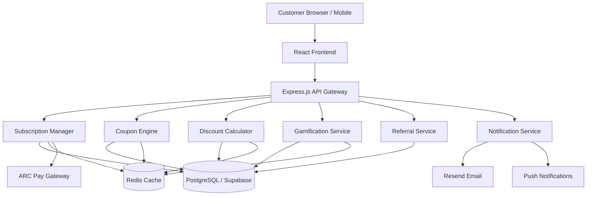

# 🚀 Jetsetters Coupon & Subscription System — Enhanced Implementation Plan

> **Reference:** Yatra.com VIP Passes + MakeMyTrip Premium + Gen Z-first UX  
> **Goal:** Maximum customer acquisition, retention, and revenue growth  
> **Stack:** Express.js + React 18 + PostgreSQL (Supabase) + Redis + ARC Pay

---

## 📋 Executive Summary

Your existing spec is **excellent and comprehensive**. This plan enhances it with:
1. **Gen Z-first UX patterns** (TikTok-style flash deals, gamified streaks, social sharing)
2. **Revenue-maximizing mechanics** (urgency timers, FOMO triggers, upsell funnels)
3. **VIP experience layers** (lounge passes, priority boarding, concierge chat)
4. **Phased delivery** (MVP → Growth → Premium) for faster time-to-market
5. **Integration map** showing exactly where each component plugs into the existing codebase

---

## 🏗️ System Architecture Overview



---

## 🎯 Membership Tier Design — Gen Z Appeal

### Tier Structure (Inspired by Yatra VIP + MakeMyTrip Black)

| Feature | 🥈 Silver Jetsetter | 🥇 Gold Jetsetter | 💎 Platinum Jetsetter |
|---|---|---|---|
| **Monthly Price** | ₹299/mo | ₹599/mo | ₹999/mo |
| **Annual Price** | ₹2,499/yr | ₹4,999/yr | ₹8,499/yr |
| **Instant Discount** | 5% off all bookings | 10% off all bookings | 15% off all bookings |
| **Points Multiplier** | 1.5x | 2x | 3x |
| **Early Flash Sale Access** | 12 hrs early | 24 hrs early | 48 hrs early |
| **Free Cancellations** | ❌ | ✅ (2/year) | ✅ Unlimited |
| **Airport Lounge Access** | ❌ | ✅ (4/year) | ✅ Unlimited |
| **Priority Support** | Email only | Email + Chat | Dedicated Concierge |
| **Travel Insurance** | ❌ | Basic | Comprehensive |
| **Companion Discount** | ❌ | 5% off companion | 10% off companion |
| **Birthday Bonus** | 200 pts | 500 pts + 5% off | 1000 pts + 10% off |

---

## 📱 Gen Z UX Patterns to Implement

### 1. FOMO-Driven Flash Sales
- **Countdown timers** on every deal card (TikTok-style urgency)
- **"X people viewing this deal"** social proof counter
- **"Only 3 left at this price"** scarcity messaging
- **Confetti animation** when coupon applied successfully

### 2. Gamification Hooks
- **Daily login streak** → bonus points (like Duolingo)
- **Travel personality quiz** → personalized tier recommendation
- **Achievement badges** shareable on Instagram Stories
- **Leaderboard** with weekly prizes (free upgrade, bonus points)
- **Spin-the-wheel** for bonus points after booking

### 3. Social Virality
- **Referral code** with custom short link (jetset.me/YOURCODE)
- **Share booking** on WhatsApp/Instagram → earn 50 bonus points
- **Group booking discount** → 5% extra off for 3+ travelers
- **"Brag card"** — shareable card showing total savings

### 4. Instant Gratification
- **New subscriber instant discount** — 20% off first booking (any tier)
- **Welcome coupon** delivered in < 5 seconds of signup
- **Real-time price drop** animation when coupon applied
- **Savings summary** shown prominently throughout checkout

---

## 🗂️ Phase-by-Phase Implementation Plan

### PHASE 1 — Database Foundation
**Files to create:**
- [`backend/migrations/subscription-tables.sql`](backend/migrations/subscription-tables.sql) — membership_tiers, subscriptions, subscription_history
- [`backend/migrations/coupon-tables.sql`](backend/migrations/coupon-tables.sql) — coupons, coupon_redemptions
- [`backend/migrations/gamification-tables.sql`](backend/migrations/gamification-tables.sql) — gamification_points, user_achievements
- [`backend/migrations/referral-tables.sql`](backend/migrations/referral-tables.sql) — referrals table
- [`backend/migrations/discount-tables.sql`](backend/migrations/discount-tables.sql) — discount_transactions
- [`backend/seeds/membership-tiers.sql`](backend/seeds/membership-tiers.sql) — Silver, Gold, Platinum seed data

**Key additions vs. existing spec:**
- Add `welcome_coupon_sent` boolean to subscriptions table
- Add `spin_wheel_used_today` to gamification_points for daily spin mechanic
- Add `social_shares` counter to gamification_points
- Add `group_booking_id` to coupon_redemptions for group discount tracking

---

### PHASE 2 — Backend Core Services

#### 2A. [`backend/services/subscription-manager.js`](backend/services/subscription-manager.js)
Core methods from spec PLUS:
- `sendWelcomeCoupon(userId)` — instant 20% off coupon on new subscription
- `generateBirthdayBonus(userId)` — auto-award birthday points/discount
- `checkCompanionDiscount(userId, bookingId)` — apply companion discount for Gold/Platinum
- `generateGroupDiscount(bookingIds[])` — 5% extra for group bookings

#### 2B. [`backend/services/coupon-engine.js`](backend/services/coupon-engine.js)
Core methods from spec PLUS:
- `generateAbandonmentCoupon(userId, bookingContext)` — cart abandonment recovery
- `generateSpinWheelCoupon(userId)` — daily spin reward
- `createGroupCoupon(bookingIds[])` — group booking discount
- `getFlashSaleCountdown(offerId)` — real-time countdown data

#### 2C. [`backend/services/discount-calculator.js`](backend/services/discount-calculator.js)
Core methods from spec PLUS:
- `calculateGroupDiscount(travelers, amount)` — group size discount
- `applyBirthdayDiscount(userId, amount)` — birthday special pricing
- `calculateFirstBookingDiscount(userId, amount)` — new subscriber welcome deal

#### 2D. [`backend/services/gamification.js`](backend/services/gamification.js)
Core methods from spec PLUS:
- `spinWheel(userId)` — daily spin mechanic (50-500 points)
- `awardSocialSharePoints(userId, platform)` — WhatsApp/Instagram share reward
- `checkDailyLoginStreak(userId)` — Duolingo-style streak tracking
- `generateShareableCard(userId)` — savings brag card data

#### 2E. [`backend/services/referral.js`](backend/services/referral.js)
Core methods from spec PLUS:
- `generateCustomShortLink(userId)` — jetset.me/YOURCODE style links
- `trackGroupReferral(referralIds[])` — group signup bonus

---

### PHASE 3 — Backend API Routes

New routes to add to [`server.js`](server.js):
```
/api/subscriptions/*     → backend/routes/subscriptions.js
/api/coupons/*           → backend/routes/coupons.js
/api/discounts/*         → backend/routes/discounts.js
/api/gamification/*      → backend/routes/gamification.js
/api/referrals/*         → backend/routes/referrals.js
```

**Additional Gen Z endpoints:**
- `POST /api/gamification/spin` — daily spin wheel
- `POST /api/gamification/share` — award social share points
- `GET /api/coupons/flash-sales` — active flash sales with countdown
- `POST /api/coupons/abandon` — trigger abandonment coupon
- `GET /api/subscriptions/savings-card/:userId` — shareable savings card data

---

### PHASE 4 — Scheduled Background Jobs

| Job File | Schedule | Purpose |
|---|---|---|
| [`backend/jobs/subscription-renewal.js`](backend/jobs/subscription-renewal.js) | Daily 2 AM UTC | Auto-renew + retry failed payments |
| [`backend/jobs/renewal-reminders.js`](backend/jobs/renewal-reminders.js) | Daily 10 AM | 7-day and 1-day reminders |
| [`backend/jobs/coupon-expiry.js`](backend/jobs/coupon-expiry.js) | Hourly | Mark expired coupons, send alerts |
| [`backend/jobs/leaderboard-update.js`](backend/jobs/leaderboard-update.js) | Daily midnight | Recalculate rankings |
| [`backend/jobs/analytics-aggregation.js`](backend/jobs/analytics-aggregation.js) | Daily 3 AM | Aggregate metrics |
| [`backend/jobs/birthday-bonuses.js`](backend/jobs/birthday-bonuses.js) | Daily 6 AM | Award birthday bonuses |
| [`backend/jobs/abandonment-coupons.js`](backend/jobs/abandonment-coupons.js) | Every 30 min | Send cart abandonment coupons |

---

### PHASE 5 — Frontend: Subscription UI

#### New Components to Create:

**[`resources/js/Pages/Common/Subscription/`](resources/js/Pages/Common/Subscription/)**
- `MembershipTiers.jsx` — Tier comparison cards with monthly/annual toggle, animated "Most Popular" badge, savings calculator
- `SubscriptionDashboard.jsx` — Current plan status, savings meter, membership card, quick actions
- `TierChangeModal.jsx` — Side-by-side comparison, prorated cost display, upgrade CTA
- `CancelSubscriptionModal.jsx` — Retention flow with counter-offer (e.g., "Stay for 50% off next month")
- `MembershipCard.jsx` — Digital card with QR code, Apple/Google Wallet buttons, tier badge

**Integration points in existing files:**
- [`resources/js/Pages/Common/Navbar.jsx`](resources/js/Pages/Common/Navbar.jsx) — Add VIP badge next to user avatar
- [`resources/js/Pages/Common/login/profiledashboard.jsx`](resources/js/Pages/Common/login/profiledashboard.jsx) — Add subscription section
- [`resources/js/Pages/Common/login/SupabaseProfileDashboard.jsx`](resources/js/Pages/Common/login/SupabaseProfileDashboard.jsx) — Add membership card widget

---

### PHASE 6 — Frontend: Coupon UI

**[`resources/js/Pages/Common/Coupon/`](resources/js/Pages/Common/Coupon/)**
- `CouponInput.jsx` — One-tap apply, confetti animation on success, error states
- `AvailableCoupons.jsx` — Scrollable card grid, countdown timers, filter by type
- `PersonalizedOffers.jsx` — "Just for You" section with AI-powered recommendations
- `FlashSaleBanner.jsx` — Sticky banner with countdown, VIP early access badge, FOMO copy

**Integration points:**
- [`resources/js/Pages/Common/flights/FlightPayment.jsx`](resources/js/Pages/Common/flights/FlightPayment.jsx) — Add CouponInput + AvailableCoupons
- [`resources/js/Pages/Common/hotels/HotelBookingSummary.jsx`](resources/js/Pages/Common/hotels/HotelBookingSummary.jsx) — Add coupon section
- [`resources/js/Pages/Common/packages/PackageBookingSummary.jsx`](resources/js/Pages/Common/packages/PackageBookingSummary.jsx) — Add coupon section
- [`resources/js/Pages/Common/cruise/CruiseBookingSummary.jsx`](resources/js/Pages/Common/cruise/CruiseBookingSummary.jsx) — Add coupon section

---

### PHASE 7 — Frontend: Discount Display

**[`resources/js/Pages/Common/Discount/`](resources/js/Pages/Common/Discount/)**
- `PriceBreakdown.jsx` — Animated price drop, itemized discounts, "You saved ₹X!" highlight
- `InstantDiscountBadge.jsx` — VIP price tag on search result cards

**Integration points:**
- [`resources/js/Pages/Common/flights/flightsearchpage.jsx`](resources/js/Pages/Common/flights/flightsearchpage.jsx) — Add VIP price badges
- [`resources/js/Pages/Common/hotels/SearchHotels.jsx`](resources/js/Pages/Common/hotels/SearchHotels.jsx) — Add VIP price badges
- [`resources/js/Pages/Common/packages/planding.jsx`](resources/js/Pages/Common/packages/planding.jsx) — Add VIP price badges

---

### PHASE 8 — Frontend: Gamification UI

**[`resources/js/Pages/Common/Gamification/`](resources/js/Pages/Common/Gamification/)**
- `ProfileDashboard.jsx` — Points balance, tier progress bar, badges grid, leaderboard rank
- `PointsRedemption.jsx` — Slider to choose points amount, coupon preview, redeem button
- `Leaderboard.jsx` — Top 10 with avatars, weekly/monthly/all-time tabs, user highlight
- `BadgeCollection.jsx` — Earned + locked badges, unlock requirements, share button
- `StreakTracker.jsx` — Calendar heatmap, current streak, multiplier display
- `SpinWheel.jsx` — Daily spin animation, prize reveal, points award

---

### PHASE 9 — Frontend: Referral UI

**[`resources/js/Pages/Common/Referral/`](resources/js/Pages/Common/Referral/)**
- `ReferralDashboard.jsx` — Unique code, copy button, WhatsApp/Instagram share, stats
- `ReferralCodeInput.jsx` — Signup form field with referrer preview
- `RewardNotification.jsx` — Celebratory modal when referral completes booking
- `SavingsShareCard.jsx` — Instagram-ready card showing total savings (shareable image)

---

### PHASE 10 — Booking Flow Integration

#### Search Results Pages
Add to all search result cards:
```jsx
// Show VIP price for subscribed users
{isVIPMember && <InstantDiscountBadge discount={instantDiscount} />}
{!isVIPMember && <SubscriptionUpsell potentialSavings={calculateSavings(price)} />}
```

#### Checkout Pages (FlightPayment, HotelBookingSummary, PackageBookingSummary, CruiseBookingSummary)
Add:
1. `CouponInput` component above payment button
2. `AvailableCoupons` expandable section
3. `PriceBreakdown` replacing simple total display
4. Points earned preview ("You'll earn 250 points for this booking")

#### Booking Confirmation Pages
Add:
1. Total savings summary with confetti
2. Points earned notification
3. "Share your booking" button for bonus points
4. Referral code prompt for first-time bookers

---

### PHASE 11 — Admin Dashboard

**New admin pages in [`resources/js/Pages/Admin/`](resources/js/Pages/Admin/):**
- `CouponManagement.jsx` — Create/edit/deactivate coupons, bulk operations, emergency kill switch
- `SubscriptionAnalytics.jsx` — MRR, churn, tier distribution, LTV charts
- `CouponAnalytics.jsx` — Redemption rates, ROI, top campaigns, real-time usage
- `SupportTools.jsx` — Customer lookup, manual extension, compensation coupon generator

**Integration with existing [`resources/js/Pages/Admin/AdminDashboard.jsx`](resources/js/Pages/Admin/AdminDashboard.jsx)**

---

### PHASE 12 — Notification Service

**[`backend/services/notification.js`](backend/services/notification.js)**

Email templates (via Resend):
- Subscription welcome + membership card
- Renewal reminder (7 days, 1 day)
- Flash sale alert (VIP early access)
- Points earned summary
- Badge unlocked celebration
- Referral reward received
- Cart abandonment with coupon

Push notifications (if mobile app):
- Flash sale starting in 1 hour
- Coupon expiring in 24 hours
- Leaderboard rank change
- Referral completed first booking

---

### PHASE 13 — Security and Compliance

**[`backend/services/audit-logger.js`](backend/services/audit-logger.js)**
- Log all subscription changes with IP + user agent
- Log all coupon redemptions
- Log all support agent actions
- 7-year retention policy

**Fraud Prevention:**
- Rate limiting: 5 coupon validations/minute per user (Redis)
- Velocity checks: flag >10 redemptions/hour
- Device fingerprinting for subscription payments
- Emergency coupon deactivation API (< 5 min response)
- Blacklist management for abusive accounts

---

### PHASE 14 — Performance Optimization

**Redis Caching Strategy:**

| Cache Key | TTL | Data |
|---|---|---|
| `tier:{id}` | 1 hour | Membership tier details |
| `subscription:user:{userId}` | 10 min | User's active subscription |
| `coupon:{code}` | 5 min | Coupon validation data |
| `coupons:available:{userId}` | 3 min | User's eligible coupons |
| `leaderboard:{period}` | 24 hours | Leaderboard rankings |
| `ratelimit:{userId}:{action}` | 1 min | Rate limit counters |
| `flash-sales:active` | 1 min | Active flash sales |

**Database Indexes** (all defined in migration files):
- Composite index on `subscriptions(user_id, status)`
- Index on `coupons(code)` for fast lookups
- Index on `coupon_redemptions(user_id, coupon_id)` for duplicate prevention
- Index on `gamification_points(user_id)` for balance queries

---

### PHASE 15 — Testing Strategy

**Integration Tests:**
- Full subscription lifecycle (create → upgrade → pause → resume → cancel)
- Coupon validation → application → booking → cancellation → restore
- Discount stacking rules (membership + stackable coupon)
- Referral flow (signup → first booking → reward distribution)

**E2E Tests:**
- VIP subscription journey (view tiers → subscribe → see VIP prices → book → view savings)
- Coupon redemption journey (search → apply coupon → checkout → confirm)
- Gamification journey (book → earn points → unlock badge → redeem for coupon)
- Referral journey (generate code → friend signs up → friend books → both rewarded)

**Performance Tests:**
- 10,000 concurrent coupon validations (target: < 2s at p95)
- 1,000 concurrent subscription transactions (target: no degradation)
- Discount calculation under load (target: < 1s at p95)

---

### PHASE 16 — Deployment

**Environment Variables to add to [`.env.example`](.env.example):**
```
REDIS_URL=
SUBSCRIPTION_WEBHOOK_SECRET=
COUPON_ENCRYPTION_KEY=
GAMIFICATION_POINTS_PER_RUPEE=1
REFERRAL_REWARD_POINTS=500
WELCOME_COUPON_DISCOUNT=20
SPIN_WHEEL_MIN_POINTS=50
SPIN_WHEEL_MAX_POINTS=500
```

**Deployment Checklist:**
1. Run all migration SQL files in order
2. Load membership tier seed data
3. Configure Redis connection
4. Set up cron jobs for background tasks
5. Configure Resend email templates
6. Test ARC Pay subscription billing
7. Warm Redis cache with tier data
8. Enable feature flags for gradual rollout

---

## 🔌 Integration Map — Existing Files to Modify

| Existing File | What to Add |
|---|---|
| [`server.js`](server.js) | Mount new API routes (/api/subscriptions, /api/coupons, etc.) |
| [`resources/js/app.jsx`](resources/js/app.jsx) | Add routes for subscription pages, gamification pages |
| [`resources/js/Pages/Common/Navbar.jsx`](resources/js/Pages/Common/Navbar.jsx) | VIP badge, points balance display |
| [`resources/js/Pages/Common/login/profiledashboard.jsx`](resources/js/Pages/Common/login/profiledashboard.jsx) | Subscription section, gamification stats |
| [`resources/js/Pages/Common/flights/FlightPayment.jsx`](resources/js/Pages/Common/flights/FlightPayment.jsx) | CouponInput, PriceBreakdown, AvailableCoupons |
| [`resources/js/Pages/Common/hotels/HotelBookingSummary.jsx`](resources/js/Pages/Common/hotels/HotelBookingSummary.jsx) | CouponInput, PriceBreakdown |
| [`resources/js/Pages/Common/packages/PackageBookingSummary.jsx`](resources/js/Pages/Common/packages/PackageBookingSummary.jsx) | CouponInput, PriceBreakdown |
| [`resources/js/Pages/Common/cruise/CruiseBookingSummary.jsx`](resources/js/Pages/Common/cruise/CruiseBookingSummary.jsx) | CouponInput, PriceBreakdown |
| [`resources/js/Pages/Common/flights/flightsearchpage.jsx`](resources/js/Pages/Common/flights/flightsearchpage.jsx) | InstantDiscountBadge, SubscriptionUpsell |
| [`resources/js/Pages/Common/hotels/SearchHotels.jsx`](resources/js/Pages/Common/hotels/SearchHotels.jsx) | InstantDiscountBadge, SubscriptionUpsell |
| [`resources/js/Pages/Common/login/signup.jsx`](resources/js/Pages/Common/login/signup.jsx) | ReferralCodeInput field |
| [`resources/js/Pages/Admin/AdminDashboard.jsx`](resources/js/Pages/Admin/AdminDashboard.jsx) | Links to new admin panels |
| [`backend/middleware/auth.middleware.js`](backend/middleware/auth.middleware.js) | Add VIP status to JWT payload |

---

## 💡 Revenue-Maximizing Features (Beyond the Spec)

### 1. Subscription Upsell Triggers
- Show "You could have saved ₹X with Gold" after every booking for non-subscribers
- Show upgrade prompt when user's savings would exceed tier cost
- "Your friends are saving more" social proof on tier selection

### 2. Coupon Scarcity Engine
- "Only 47 uses remaining" counter on popular coupons
- "Expires in 2:34:17" countdown on flash deals
- "VIP members got this 24 hours ago" messaging for public deals

### 3. Loyalty Loop
- Points expire after 12 months → urgency to redeem
- Tier downgrade warning 30 days before → motivates booking
- "You're 200 points away from Gold" progress notification

### 4. Group & Social Features
- Group booking discount (3+ travelers = extra 5%)
- "Travel with friends" referral bonus (both get 10% off same trip)
- Corporate/family plan (up to 5 members under one subscription)

### 5. Partner Ecosystem
- Hotel partner coupons (exclusive rates for Platinum members)
- Airline lounge access via partner integration
- Travel insurance auto-apply for Gold/Platinum

---

## 📊 Success Metrics to Track

| Metric | Target |
|---|---|
| Subscription conversion rate | > 8% of active users |
| Coupon redemption rate | > 25% of eligible bookings |
| Average discount per booking | 12-15% |
| Subscription retention (monthly) | > 75% |
| Referral conversion rate | > 30% of referred users book |
| Points redemption rate | > 40% of earned points |
| Revenue uplift from VIP members | > 35% higher LTV |

---

## ✅ Assessment of Your Existing Plan

Your existing spec in `.kiro/specs/coupon-subscription-system/` is **production-grade quality**:

**Strengths:**
- ✅ Complete database schema with proper indexes and constraints
- ✅ Comprehensive API endpoint design
- ✅ Well-defined service interfaces with TypeScript types
- ✅ Redis caching strategy with appropriate TTLs
- ✅ Fraud prevention and security requirements
- ✅ Multi-currency and multi-language support
- ✅ Partner integration framework
- ✅ 46 correctness properties for testing
- ✅ Performance targets (< 2s coupon validation, < 1s discount calculation)

**Enhancements Added in This Plan:**
- 🆕 Gen Z UX patterns (spin wheel, daily streaks, shareable cards)
- 🆕 Revenue-maximizing mechanics (FOMO timers, scarcity counters, upsell triggers)
- 🆕 Group booking discounts
- 🆕 Birthday bonus system
- 🆕 Cart abandonment coupon automation
- 🆕 Social sharing points rewards
- 🆕 Exact integration map for all existing files
- 🆕 Phased delivery approach (MVP → Growth → Premium)
- 🆕 Success metrics dashboard

---

## 🚦 Recommended Delivery Order (MVP First)

### MVP (Core Revenue Features)
1. Database migrations + seed data
2. SubscriptionManager + CouponEngine + DiscountCalculator services
3. Subscription API routes + Coupon API routes
4. MembershipTiers.jsx + CouponInput.jsx + PriceBreakdown.jsx
5. Integrate into FlightPayment.jsx + HotelBookingSummary.jsx
6. Basic notification emails (welcome, renewal reminder)

### Growth (Engagement Features)
7. Gamification service + API routes
8. Referral service + API routes
9. Gamification UI (ProfileDashboard, Leaderboard, BadgeCollection)
10. Referral UI (ReferralDashboard, ReferralCodeInput)
11. Flash sales + countdown timers
12. Admin dashboard (CouponManagement, SubscriptionAnalytics)

### Premium (Delight Features)
13. Spin wheel daily mechanic
14. Social sharing + shareable savings cards
15. Group booking discounts
16. Birthday bonus automation
17. Cart abandonment coupons
18. Mobile wallet membership cards
19. Partner integrations
20. Full performance testing + load testing
