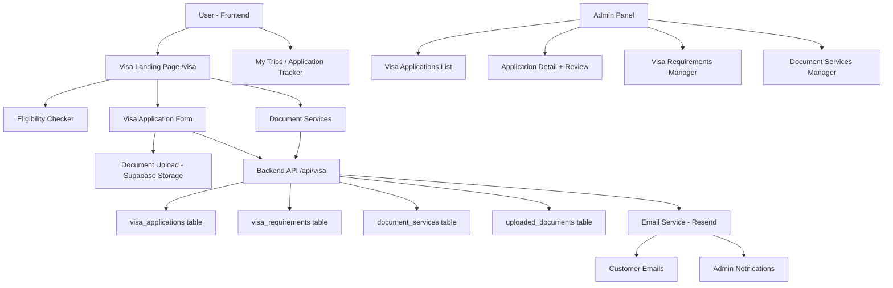
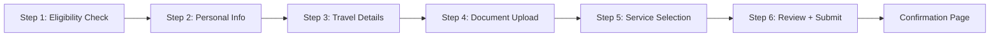
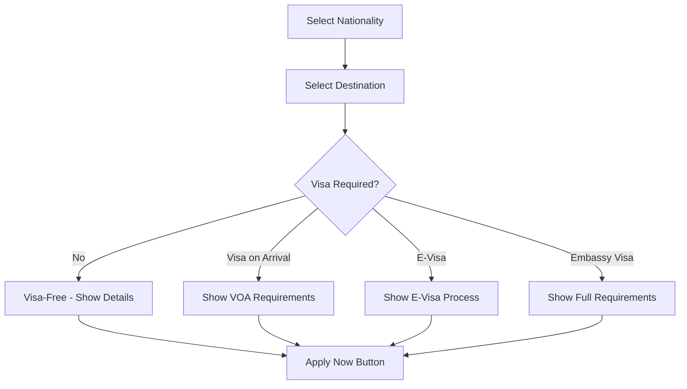
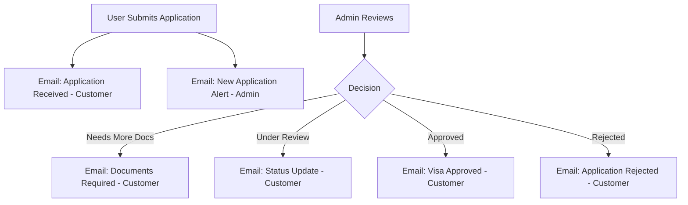

# Visa & Document Services — Implementation Plan

## 1. Overview

This plan introduces a full **Visa & Document Services** module into the JetSetters travel platform. The feature covers:

- **Visa Eligibility Checker** — users select nationality + destination to see visa requirements
- **Visa Application Service** — users submit visa applications with document uploads
- **Document Services** — passport renewal assistance, travel insurance, travel permits
- **Application Tracking** — real-time status tracking for submitted applications
- **Admin Management Panel** — admins review, process, and update application statuses
- **Email Notifications** — automated emails at every stage of the process

---

## 2. System Architecture



---

## 3. Database Schema Design

### 3.1 `visa_requirements` Table
Stores admin-managed visa requirement data for country pairs.

```sql
CREATE TABLE visa_requirements (
    id UUID PRIMARY KEY DEFAULT uuid_generate_v4(),
    nationality_country TEXT NOT NULL,       -- e.g. "IN" (India)
    destination_country TEXT NOT NULL,       -- e.g. "US" (United States)
    visa_required BOOLEAN NOT NULL DEFAULT true,
    visa_type TEXT,                          -- tourist, business, transit, e-visa, visa-on-arrival
    processing_time TEXT,                    -- e.g. "5-10 business days"
    validity TEXT,                           -- e.g. "90 days / 6 months"
    max_stay TEXT,                           -- e.g. "30 days per entry"
    entry_type TEXT,                         -- single, double, multiple
    fee_usd DECIMAL(10,2),
    fee_currency TEXT DEFAULT 'USD',
    requirements JSONB DEFAULT '[]',         -- array of required documents
    notes TEXT,
    embassy_url TEXT,
    is_active BOOLEAN DEFAULT true,
    created_at TIMESTAMPTZ DEFAULT NOW(),
    updated_at TIMESTAMPTZ DEFAULT NOW(),
    UNIQUE(nationality_country, destination_country)
);
```

### 3.2 `visa_applications` Table
Stores user visa applications.

```sql
CREATE TABLE visa_applications (
    id UUID PRIMARY KEY DEFAULT uuid_generate_v4(),
    application_number TEXT UNIQUE NOT NULL,  -- e.g. "VISA-2026-00001"
    user_id UUID REFERENCES users(id),

    -- Applicant Info
    applicant_name TEXT NOT NULL,
    applicant_email TEXT NOT NULL,
    applicant_phone TEXT,
    date_of_birth DATE,
    nationality TEXT NOT NULL,
    passport_number TEXT,
    passport_expiry DATE,

    -- Visa Details
    destination_country TEXT NOT NULL,
    visa_type TEXT NOT NULL,                  -- tourist, business, transit, student
    travel_purpose TEXT,
    intended_arrival DATE,
    intended_departure DATE,
    number_of_entries TEXT DEFAULT 'single',

    -- Service Details
    service_type TEXT DEFAULT 'standard',     -- standard, express, premium
    service_fee DECIMAL(10,2),
    currency TEXT DEFAULT 'USD',

    -- Status Tracking
    status TEXT DEFAULT 'submitted' CHECK (status IN (
        'submitted', 'documents_pending', 'under_review',
        'additional_info_required', 'approved', 'rejected',
        'cancelled', 'completed'
    )),
    status_notes TEXT,
    rejection_reason TEXT,

    -- Admin Processing
    assigned_admin UUID REFERENCES users(id),
    priority TEXT DEFAULT 'normal' CHECK (priority IN ('low', 'normal', 'high', 'urgent')),
    internal_notes TEXT,

    -- Payment
    payment_status TEXT DEFAULT 'pending' CHECK (payment_status IN ('pending', 'paid', 'refunded')),
    payment_reference TEXT,

    -- Timestamps
    submitted_at TIMESTAMPTZ DEFAULT NOW(),
    reviewed_at TIMESTAMPTZ,
    completed_at TIMESTAMPTZ,
    created_at TIMESTAMPTZ DEFAULT NOW(),
    updated_at TIMESTAMPTZ DEFAULT NOW()
);
```

### 3.3 `visa_application_documents` Table
Stores uploaded documents linked to visa applications.

```sql
CREATE TABLE visa_application_documents (
    id UUID PRIMARY KEY DEFAULT uuid_generate_v4(),
    application_id UUID NOT NULL REFERENCES visa_applications(id) ON DELETE CASCADE,
    user_id UUID NOT NULL REFERENCES users(id),

    document_type TEXT NOT NULL,             -- passport_copy, photo, bank_statement, etc.
    document_name TEXT NOT NULL,
    file_path TEXT NOT NULL,                 -- Supabase Storage path
    file_size INTEGER,
    mime_type TEXT,
    is_verified BOOLEAN DEFAULT false,
    verified_by UUID REFERENCES users(id),
    verification_notes TEXT,

    created_at TIMESTAMPTZ DEFAULT NOW(),
    updated_at TIMESTAMPTZ DEFAULT NOW()
);
```

### 3.4 `document_services` Table
Stores requests for non-visa document services (passport renewal, travel insurance, etc.).

```sql
CREATE TABLE document_services (
    id UUID PRIMARY KEY DEFAULT uuid_generate_v4(),
    service_number TEXT UNIQUE NOT NULL,     -- e.g. "DOC-2026-00001"
    user_id UUID REFERENCES users(id),

    -- Customer Info
    customer_name TEXT NOT NULL,
    customer_email TEXT NOT NULL,
    customer_phone TEXT,

    -- Service Details
    service_type TEXT NOT NULL CHECK (service_type IN (
        'passport_renewal', 'travel_insurance', 'travel_permit',
        'document_attestation', 'translation', 'other'
    )),
    service_description TEXT,
    country TEXT,
    urgency TEXT DEFAULT 'standard' CHECK (urgency IN ('standard', 'express', 'urgent')),

    -- Status
    status TEXT DEFAULT 'pending' CHECK (status IN (
        'pending', 'in_progress', 'completed', 'cancelled'
    )),

    -- Pricing
    estimated_fee DECIMAL(10,2),
    currency TEXT DEFAULT 'USD',
    payment_status TEXT DEFAULT 'pending',

    -- Admin
    assigned_admin UUID REFERENCES users(id),
    internal_notes TEXT,

    -- Timestamps
    created_at TIMESTAMPTZ DEFAULT NOW(),
    updated_at TIMESTAMPTZ DEFAULT NOW()
);
```

### 3.5 `visa_application_timeline` Table
Tracks status history for audit trail.

```sql
CREATE TABLE visa_application_timeline (
    id UUID PRIMARY KEY DEFAULT uuid_generate_v4(),
    application_id UUID NOT NULL REFERENCES visa_applications(id) ON DELETE CASCADE,
    status TEXT NOT NULL,
    notes TEXT,
    changed_by UUID REFERENCES users(id),
    created_at TIMESTAMPTZ DEFAULT NOW()
);
```

---

## 4. Backend API Design

### 4.1 New Route File: `backend/routes/visa.routes.js`

| Method | Endpoint | Access | Description |
|--------|----------|--------|-------------|
| `GET` | `/api/visa/requirements` | Public | Get visa requirements by nationality + destination |
| `GET` | `/api/visa/requirements/countries` | Public | Get list of all supported countries |
| `POST` | `/api/visa/applications` | Auth | Submit new visa application |
| `GET` | `/api/visa/applications/my` | Auth | Get user's own applications |
| `GET` | `/api/visa/applications/:id` | Auth | Get specific application details |
| `PUT` | `/api/visa/applications/:id/cancel` | Auth | Cancel an application |
| `POST` | `/api/visa/applications/:id/documents` | Auth | Upload document to application |
| `GET` | `/api/visa/applications/:id/documents` | Auth | List documents for application |
| `POST` | `/api/visa/document-services` | Auth/Public | Submit document service request |
| `GET` | `/api/visa/document-services/my` | Auth | Get user's document service requests |

### 4.2 Admin Routes: `backend/routes/admin.routes.js` (extended)

| Method | Endpoint | Access | Description |
|--------|----------|--------|-------------|
| `GET` | `/api/admin/visa/applications` | Admin | List all visa applications with filters |
| `GET` | `/api/admin/visa/applications/:id` | Admin | Get full application details |
| `PUT` | `/api/admin/visa/applications/:id/status` | Admin | Update application status |
| `PUT` | `/api/admin/visa/applications/:id/assign` | Admin | Assign to admin |
| `GET` | `/api/admin/visa/requirements` | Admin | List all visa requirements |
| `POST` | `/api/admin/visa/requirements` | Admin | Create visa requirement |
| `PUT` | `/api/admin/visa/requirements/:id` | Admin | Update visa requirement |
| `DELETE` | `/api/admin/visa/requirements/:id` | Admin | Delete visa requirement |
| `GET` | `/api/admin/visa/document-services` | Admin | List all document service requests |
| `PUT` | `/api/admin/visa/document-services/:id/status` | Admin | Update document service status |
| `GET` | `/api/admin/visa/stats` | Admin | Visa service statistics |

### 4.3 New Files to Create

```
backend/
├── controllers/
│   └── visa.controller.js          # Visa application CRUD + document upload
├── models/
│   └── visa.model.js               # Supabase queries for visa tables
├── routes/
│   └── visa.routes.js              # Route definitions
├── services/
│   └── visa.service.js             # Business logic, document storage
├── migrations/
│   └── visa_document_services_schema.sql  # All new tables
```

---

## 5. Frontend Pages & Components

### 5.1 New Pages

```
resources/js/Pages/Common/visa/
├── VisaLanding.jsx                 # Main visa services landing page
├── VisaEligibilityChecker.jsx      # Nationality + destination checker
├── VisaApplicationForm.jsx         # Multi-step visa application form
├── VisaApplicationSuccess.jsx      # Confirmation after submission
├── VisaApplicationTracker.jsx      # Track application status
├── DocumentServicesLanding.jsx     # Document services overview
├── DocumentServiceForm.jsx         # Request document service
└── VisaGuide.jsx                   # Country-specific visa guides
```

### 5.2 Admin Pages

```
resources/js/Pages/Admin/
├── VisaApplicationsList.jsx        # Admin list of all visa applications
├── VisaApplicationDetail.jsx       # Full application review + status update
├── VisaRequirementsManager.jsx     # CRUD for visa requirements database
└── DocumentServicesList.jsx        # Admin list of document service requests
```

### 5.3 Multi-Step Visa Application Form Flow



**Step 1 — Eligibility Check:**
- Select nationality (dropdown with flags)
- Select destination country
- Show visa requirements, processing time, fees, required documents

**Step 2 — Personal Information:**
- Full name, date of birth, nationality
- Passport number, passport expiry date
- Contact email, phone

**Step 3 — Travel Details:**
- Visa type (tourist/business/transit/student)
- Intended arrival/departure dates
- Purpose of travel
- Number of entries

**Step 4 — Document Upload:**
- Dynamic checklist based on visa requirements
- Drag-and-drop file upload (PDF, JPG, PNG)
- Progress indicator per document
- Supabase Storage upload

**Step 5 — Service Selection:**
- Standard processing (5-10 days)
- Express processing (2-3 days) — premium fee
- Premium concierge (1-2 days) — highest fee
- Service fee display in user's currency

**Step 6 — Review & Submit:**
- Summary of all entered information
- Terms acceptance
- Submit button

### 5.4 Visa Eligibility Checker Component



---

## 6. Navigation & Routing Updates

### 6.1 Navbar Update (`Navbar.jsx`)
Add "Visa & Docs" link to desktop nav and mobile menu:
```jsx
<Link to="/visa" className={`nav-link ${isActive('/visa') ? 'active' : ''}`}>
  Visa & Docs
</Link>
```

### 6.2 Footer Update (`Footer.jsx`)
Add to "Travel" section:
```jsx
<Link to="/visa" className="footer-nav-link">Visa & Documents</Link>
```

### 6.3 New Routes in `app.jsx`

```jsx
// Visa & Document Services
const VisaLanding = React.lazy(() => import('./Pages/Common/visa/VisaLanding'));
const VisaApplicationForm = React.lazy(() => import('./Pages/Common/visa/VisaApplicationForm'));
const VisaApplicationTracker = React.lazy(() => import('./Pages/Common/visa/VisaApplicationTracker'));
const DocumentServicesLanding = React.lazy(() => import('./Pages/Common/visa/DocumentServicesLanding'));

// Routes
<Route path="/visa" element={<VisaLanding />} />
<Route path="/visa/apply" element={<VisaApplicationForm />} />
<Route path="/visa/track" element={<VisaApplicationTracker />} />
<Route path="/visa/track/:applicationId" element={<VisaApplicationTracker />} />
<Route path="/visa/documents" element={<DocumentServicesLanding />} />
```

### 6.4 Admin Routes in `app.jsx`

```jsx
<Route path="/admin/visa/applications" element={<VisaApplicationsList />} />
<Route path="/admin/visa/applications/:id" element={<VisaApplicationDetail />} />
<Route path="/admin/visa/requirements" element={<VisaRequirementsManager />} />
<Route path="/admin/visa/document-services" element={<DocumentServicesList />} />
```

---

## 7. Supabase Storage Integration

### 7.1 Storage Bucket Setup
Create a new Supabase Storage bucket: `visa-documents`

```sql
-- Storage bucket policies
INSERT INTO storage.buckets (id, name, public) VALUES ('visa-documents', 'visa-documents', false);

-- RLS: Users can upload to their own folder
CREATE POLICY "Users can upload visa documents"
ON storage.objects FOR INSERT
WITH CHECK (
    bucket_id = 'visa-documents' AND
    auth.uid()::text = (storage.foldername(name))[1]
);

-- RLS: Users can view their own documents
CREATE POLICY "Users can view their own visa documents"
ON storage.objects FOR SELECT
USING (
    bucket_id = 'visa-documents' AND
    auth.uid()::text = (storage.foldername(name))[1]
);

-- RLS: Admins can view all documents
CREATE POLICY "Admins can view all visa documents"
ON storage.objects FOR SELECT
USING (
    bucket_id = 'visa-documents' AND
    EXISTS (SELECT 1 FROM admin_users WHERE id = auth.uid())
);
```

### 7.2 File Organization Structure
```
visa-documents/
└── {user_id}/
    └── {application_id}/
        ├── passport_copy.pdf
        ├── photo.jpg
        ├── bank_statement.pdf
        └── ...
```

### 7.3 Document Upload Service (`visa.service.js`)
```javascript
// Upload document to Supabase Storage
async uploadDocument(userId, applicationId, file, documentType) {
    const filePath = `${userId}/${applicationId}/${documentType}_${Date.now()}`;
    const { data, error } = await supabase.storage
        .from('visa-documents')
        .upload(filePath, file);
    // Store reference in visa_application_documents table
}
```

---

## 8. Email Notification Templates

### 8.1 New Email Templates in `emailService.js`

| Template | Trigger | Recipient |
|----------|---------|-----------|
| `generateVisaApplicationReceivedTemplate` | Application submitted | Customer |
| `generateVisaApplicationAdminNotificationTemplate` | Application submitted | Admin |
| `generateVisaStatusUpdateTemplate` | Status changed by admin | Customer |
| `generateVisaDocumentRequestTemplate` | Admin requests more docs | Customer |
| `generateVisaApprovedTemplate` | Application approved | Customer |
| `generateVisaRejectedTemplate` | Application rejected | Customer |
| `generateDocumentServiceReceivedTemplate` | Doc service submitted | Customer |
| `generateDocumentServiceCompletedTemplate` | Doc service completed | Customer |

### 8.2 Email Flow



---

## 9. Admin Panel Extensions

### 9.1 Admin Dashboard Stats Widget
Add visa service stats to existing [`AdminDashboard.jsx`](resources/js/Pages/Admin/AdminDashboard.jsx):
- Total visa applications (this month)
- Pending review count
- Approved/Rejected counts
- Document service requests pending

### 9.2 Visa Applications List (`VisaApplicationsList.jsx`)
- Filterable by: status, destination country, visa type, date range
- Sortable columns: application number, date, status, priority
- Bulk actions: assign to admin, change priority
- Quick status update inline

### 9.3 Visa Application Detail (`VisaApplicationDetail.jsx`)
- Full applicant information display
- Document viewer (inline PDF/image preview)
- Status update dropdown with notes
- Timeline/audit trail of status changes
- Internal notes section
- Email customer button

### 9.4 Visa Requirements Manager (`VisaRequirementsManager.jsx`)
- Table of all country pairs with visa requirements
- Add/Edit/Delete requirements
- Bulk import via CSV
- Search by nationality or destination

---

## 10. Inquiry System Integration

Extend the existing [`inquiry-system-schema.sql`](inquiry-system-schema.sql) `inquiry_type` CHECK constraint to include `'visa'` and `'document_service'`:

```sql
-- Update existing inquiries table constraint
ALTER TABLE inquiries DROP CONSTRAINT IF EXISTS inquiries_inquiry_type_check;
ALTER TABLE inquiries ADD CONSTRAINT inquiries_inquiry_type_check
    CHECK (inquiry_type IN ('flight', 'hotel', 'cruise', 'package', 'general', 'visa', 'document_service'));
```

This allows the existing [`RequestPage.jsx`](resources/js/Pages/Request/RequestPage.jsx) to also handle visa/document inquiries as a simpler alternative to the full application form.

---

## 11. My Trips Integration

Extend [`mytrips.jsx`](resources/js/Pages/Common/login/mytrips.jsx) to show visa applications alongside travel bookings:
- New "Visa & Documents" tab in My Trips
- Show application number, destination, status, submitted date
- Link to full application tracker

---

## 12. Visa Landing Page Design

The [`VisaLanding.jsx`](resources/js/Pages/Common/visa/VisaLanding.jsx) page will include:

1. **Hero Section** — "Hassle-Free Visa Services" with eligibility checker widget
2. **Services Grid** — Tourist Visa, Business Visa, Transit Visa, Passport Renewal, Travel Insurance, Document Attestation
3. **How It Works** — 4-step process (Check Eligibility → Apply Online → Upload Documents → Track Status)
4. **Popular Destinations** — Top 10 countries with visa info cards
5. **Why Choose Us** — Expert guidance, fast processing, secure document handling
6. **FAQ Section** — Common visa questions
7. **CTA Section** — Start Application / Contact Expert

---

## 13. Implementation Phases

### Phase 1 — Foundation (Database + Backend)
1. Create database migration SQL file with all new tables
2. Create `visa.model.js` with Supabase queries
3. Create `visa.controller.js` with CRUD operations
4. Create `visa.routes.js` and register in `server.js`
5. Set up Supabase Storage bucket `visa-documents`
6. Add email templates to `emailService.js`
7. Seed initial visa requirements data for top 50 countries

### Phase 2 — User Frontend
1. Create `VisaLanding.jsx` with hero + services overview
2. Create `VisaEligibilityChecker.jsx` component
3. Create multi-step `VisaApplicationForm.jsx`
4. Create `VisaApplicationSuccess.jsx` confirmation page
5. Create `VisaApplicationTracker.jsx` status tracking page
6. Create `DocumentServicesLanding.jsx` and `DocumentServiceForm.jsx`
7. Update `Navbar.jsx` to add "Visa & Docs" link
8. Update `Footer.jsx` to add visa links
9. Update `app.jsx` with new routes

### Phase 3 — Admin Panel
1. Create `VisaApplicationsList.jsx` admin list page
2. Create `VisaApplicationDetail.jsx` admin detail + review page
3. Create `VisaRequirementsManager.jsx` CRUD interface
4. Create `DocumentServicesList.jsx` admin list
5. Update `AdminDashboard.jsx` with visa stats widget
6. Add admin routes to `app.jsx`

### Phase 4 — Integration & Polish
1. Extend `mytrips.jsx` with "Visa & Documents" tab
2. Extend `RequestPage.jsx` to include visa/document inquiry types
3. Update AI chatbot content indexer to include visa information
4. Add visa services to `content-indexer.js` for chatbot knowledge
5. End-to-end testing of full application flow
6. Mobile responsiveness testing

---

## 14. Key Files to Create/Modify

### New Files
| File | Purpose |
|------|---------|
| `backend/migrations/visa_document_services_schema.sql` | All new DB tables |
| `backend/models/visa.model.js` | Supabase data access layer |
| `backend/controllers/visa.controller.js` | Request handlers |
| `backend/routes/visa.routes.js` | API route definitions |
| `backend/services/visa.service.js` | Business logic + storage |
| `resources/js/Pages/Common/visa/VisaLanding.jsx` | Main visa page |
| `resources/js/Pages/Common/visa/VisaEligibilityChecker.jsx` | Eligibility tool |
| `resources/js/Pages/Common/visa/VisaApplicationForm.jsx` | Multi-step form |
| `resources/js/Pages/Common/visa/VisaApplicationSuccess.jsx` | Success page |
| `resources/js/Pages/Common/visa/VisaApplicationTracker.jsx` | Status tracker |
| `resources/js/Pages/Common/visa/DocumentServicesLanding.jsx` | Doc services page |
| `resources/js/Pages/Common/visa/DocumentServiceForm.jsx` | Doc service form |
| `resources/js/Pages/Admin/VisaApplicationsList.jsx` | Admin list |
| `resources/js/Pages/Admin/VisaApplicationDetail.jsx` | Admin detail |
| `resources/js/Pages/Admin/VisaRequirementsManager.jsx` | Requirements CRUD |
| `resources/js/Pages/Admin/DocumentServicesList.jsx` | Doc services admin |
| `resources/js/data/visa-requirements-seed.json` | Initial visa data |

### Modified Files
| File | Change |
|------|--------|
| [`server.js`](server.js) | Register `/api/visa` routes |
| [`resources/js/app.jsx`](resources/js/app.jsx) | Add visa routes + lazy imports |
| [`resources/js/Pages/Common/Navbar.jsx`](resources/js/Pages/Common/Navbar.jsx) | Add "Visa & Docs" nav link |
| [`resources/js/Pages/Common/Footer.jsx`](resources/js/Pages/Common/Footer.jsx) | Add visa links to footer |
| [`resources/js/Pages/Common/login/mytrips.jsx`](resources/js/Pages/Common/login/mytrips.jsx) | Add visa applications tab |
| [`resources/js/Pages/Request/RequestPage.jsx`](resources/js/Pages/Request/RequestPage.jsx) | Add visa/document inquiry types |
| [`backend/routes/admin.routes.js`](backend/routes/admin.routes.js) | Add visa admin routes |
| [`backend/services/emailService.js`](backend/services/emailService.js) | Add visa email templates |
| [`inquiry-system-schema.sql`](inquiry-system-schema.sql) | Extend inquiry_type constraint |
| [`backend/services/content-indexer.js`](backend/services/content-indexer.js) | Add visa content for chatbot |

---

## 15. Visa Requirements Seed Data

Initial data will cover the **top 50 most-traveled country pairs** including:
- US, UK, Canada, Australia, Schengen Area (EU), UAE, Singapore, Japan, Thailand, India, etc.
- Common nationality/destination combinations
- Visa-free, visa-on-arrival, e-visa, and embassy visa categories

Data structure per entry:
```json
{
  "nationality_country": "IN",
  "destination_country": "US",
  "visa_required": true,
  "visa_type": "B1/B2 Tourist/Business Visa",
  "processing_time": "3-5 weeks",
  "validity": "10 years",
  "max_stay": "180 days per visit",
  "entry_type": "multiple",
  "fee_usd": 185,
  "requirements": [
    "Valid passport (6+ months validity)",
    "DS-160 application form",
    "Passport-size photograph",
    "Bank statements (3 months)",
    "Employment/business proof",
    "Travel itinerary"
  ],
  "notes": "Interview required at US Embassy/Consulate",
  "embassy_url": "https://travel.state.gov"
}
```

---

## 16. Security Considerations

1. **Document Security** — All uploaded documents stored in private Supabase Storage bucket with RLS
2. **PII Protection** — Passport numbers and personal data encrypted at rest via Supabase
3. **Access Control** — Users can only view/modify their own applications; admins have full access
4. **File Validation** — Server-side validation of file types (PDF, JPG, PNG only) and size limits (max 5MB per file)
5. **Rate Limiting** — Apply rate limiting to application submission endpoints
6. **Audit Trail** — All status changes logged in `visa_application_timeline` table

---

## 17. Service Pricing Model

| Service | Standard | Express | Premium |
|---------|----------|---------|---------|
| Tourist Visa | $49 service fee | $89 service fee | $149 service fee |
| Business Visa | $69 service fee | $109 service fee | $179 service fee |
| Transit Visa | $29 service fee | $59 service fee | $99 service fee |
| Passport Renewal | $39 service fee | $79 service fee | $129 service fee |
| Document Attestation | $29 service fee | $59 service fee | N/A |
| Travel Insurance | Quote-based | Quote-based | Quote-based |

*Note: Service fees are in addition to government/embassy visa fees*

---

## 18. Summary of Todo Items for Implementation

```
Phase 1 - Database & Backend:
[ ] Create visa_document_services_schema.sql migration
[ ] Create visa.model.js
[ ] Create visa.controller.js
[ ] Create visa.routes.js
[ ] Register visa routes in server.js
[ ] Set up Supabase Storage bucket
[ ] Add visa email templates to emailService.js
[ ] Create visa-requirements-seed.json with 50+ country pairs

Phase 2 - User Frontend:
[ ] Create VisaLanding.jsx
[ ] Create VisaEligibilityChecker.jsx
[ ] Create VisaApplicationForm.jsx (multi-step)
[ ] Create VisaApplicationSuccess.jsx
[ ] Create VisaApplicationTracker.jsx
[ ] Create DocumentServicesLanding.jsx
[ ] Create DocumentServiceForm.jsx
[ ] Update Navbar.jsx
[ ] Update Footer.jsx
[ ] Update app.jsx with new routes

Phase 3 - Admin Panel:
[ ] Create VisaApplicationsList.jsx
[ ] Create VisaApplicationDetail.jsx
[ ] Create VisaRequirementsManager.jsx
[ ] Create DocumentServicesList.jsx
[ ] Update AdminDashboard.jsx with visa stats

Phase 4 - Integration:
[ ] Update mytrips.jsx with visa tab
[ ] Update RequestPage.jsx with visa inquiry types
[ ] Update content-indexer.js for chatbot
[ ] End-to-end testing
```
